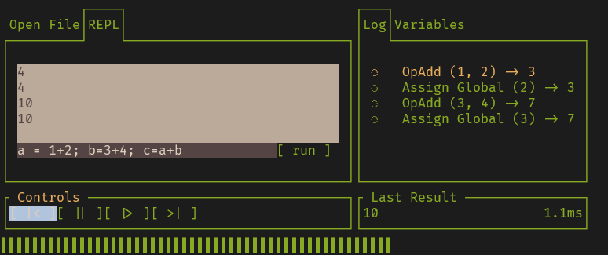

> Note: Current development of scrub is over at the [b- language project](https://github.com/hunterdyar/B-_Language). This is a simpler implementation of an inspectable, 'always debugging' runtime for students. I hope to playtest out a lot of my ideas (without the technical debt of the rewind feature). What's more important: a custom runtime, or the reversable language? I hope to learn through prototyping.

# The Scrub Language

Scrub is a language and runtime environment designed for learners.

The goal of the language is to create an investigable playground for students to learn see how programming languages work. Scrub provides a window into the black box of programming languages.

The language is simple but competent, with a permissive syntax. It's main special feature is that every operation can be reversed. "Scrub" like scrubbing a timeline.

Instead of throwing errors, the language contains a 'notice+pause' feature, which is similar to an automatic breakpoint. When you hit one, you can start stepping backwards and see how the program got into the unexpected state.

Instead of 'print' statements littering code, debugging with Scrub should leverage the 'pause()' function instead. (Scrub has print statements too).

When paused, the state of the program is completely viewable - the stack, the instruction set, and - of course - memory. You can step forwards or backwards a single operation at a time.

> My end-goal is something complex enough to handle turtle, but not much more. Turtle is most famously seen in [python](https://docs.python.org/3/library/turtle.html). I imagine scrub used by an educator (like myself) guiding students through interactive lessons with experimentation and play.

# Language Details
Scrub is an dynamically typed scripting language with first-class functions and everything is an expression.

It is generous in it's syntax - instead of blocking users from making mistakes through stricter syntax elements, the looser syntax is content with '[footguns](https://notes.rmhogervorst.nl/post/2022/11/21/what-is-a-footgun/)'. It is not designed for production, and mistakes are learning opportunities.

Notable features of scrub:

- Variables are declared implicitly.
- Everything is an expression. (a=3 will assign 3 to a, but it will also evaluate to '3'. a = b = c = 3 is valid. Many functions simply return 'null'.
- Functions are first-class. They can be passed around like any other variable.
- Semicolons to end expressions are optional. Newlines and semicolons both get parsed as a break in the expression. Whitespace is generally ignored.
- Scrub uses {curly braces} to group expressions. Indent however you like.
- Return statements are optional. An expression block ({}'s) will return whatever the last expression (last line) evaluated to. Leave a function early with an explicit return statement.
- Most types can be indexed. Indexing arrays gives you it's elements, strings will give you a characters (as a byte), and all other types will return their bits (as booleans). 
- Binary literals (0b0101), Hexadecimal literals (0xFF), and Octal literals (0o17) are all supported. 

The program "print("Hello, World")" will return "Hello World \nNull". This is correct! It's because everything is an expression. Print is an expression that writes it's arguments to the console, and then returns Null.

### Unique Syntax Elements

- '+' is sum, and '++' is either integer increment (i++) or the 'Concatenate' operator: "a ++ b" will return the string "ab". The concatenation operator is used in favor of string interpolation.
  + Which is good. Scrub does not (currently) support casting. 

## The Concept
In Scrub, every operation can be un-done. That's the [key](https://en.wikipedia.org/wiki/Reversible_computing) to all of the special sauce.
- For deterministic operations, this is completed with the "UnStack", a stack that - simply - pop's the stacks pushes and pushes the stack's pops. Undoing an op is the same as executing it on the un-stack.
- For non-deterministic operations, this is done by storing reference to state on the un-stack, and restoring that state.
- Some operations have special bytecode flags for executing in reverse only (Jump, JumpNotTruthy). These are created at compile-time. Scrub does not modify the instruction-set during execution.
  - *This is one way to achieve reversibility with less memory overhead. While scrub does not currently implement instruction stack modification, I'm not ruling anything out.*

## Workings/Inspiration
- The core of the project is inspired by the concept of Time-Travel Debugging. Particularly, a [talk](https://us.pycon.org/2024/schedule/presentation/166/) by [Toby Ho](https://tobyho.com/video/Time-Travel-Debugging-(in-Python).html). There are many interesting applications of time-travel debugging. I, in particular, want to leverage it for education.
  - *Observation 1: This would be easier to implement if you were working with a fully custom simple language instead of a fork of a complex one.*
  - *Observation 2: Code running to a failure, then a student going 'huh', and simply backing up and observing, would be an excellent learning moment.*
- The Lexer is a simple FSM with 0 lookahead.
- The Parser is based on Bob Nystrom's Blog Post '[Pratt Parsers: Expression Parsing Made Easy](https://journal.stuffwithstuff.com/2011/03/19/pratt-parsers-expression-parsing-made-easy/)'. [jfcardinal](https://github.com/jfcardinal/BantamCs) already wrote a C# port of [bantam](https://github.com/munificent/bantam), and it's fair to say that I copied their homework.
- The Compiler and Virtual Machine are based on the 'Monkey' language from [Thorsten Ball's book](thorstenball.com)" *Writing A Compiler in Go*".
- I really wanted to implement a type-less language, but it wouldn't be as useful for students to learn from. That said, permissive operators, and operating on the underlying data of objects, are important values of the scrub language. I still think operating on bytes of memory is a worthy concept to play with, and scrub supports binary literals, indexing bytes on integers, and bitwise operators.

# The Scrub Environment
**Scrub-TUI** is a Terminal User Interface that wraps the virtual machine. It provides reports on the execution of the program (state, logs, and controls). It contains a REPL and can execute scrub files.

### A TUI?
TUI is 'Terminal User Interface'. It's a quick and convenient way to develop cross-platform software. It makes the terminal accessible, familiarizing users to the interface in a friendly way. Terminals are quick and easy to develop for, and the idea that it's of the aesthetics of programming while still being easy is a positive.
